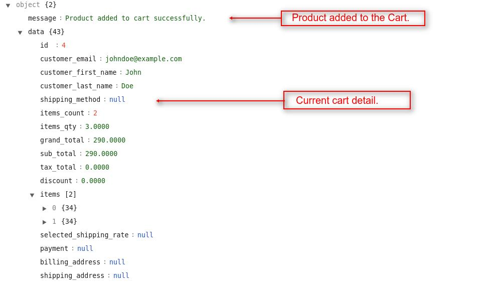
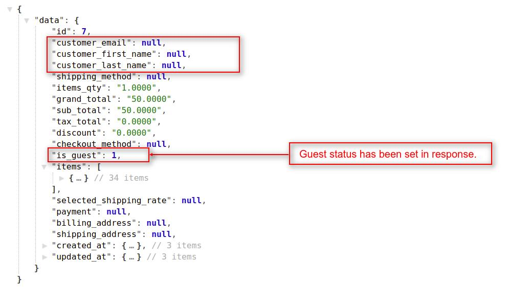
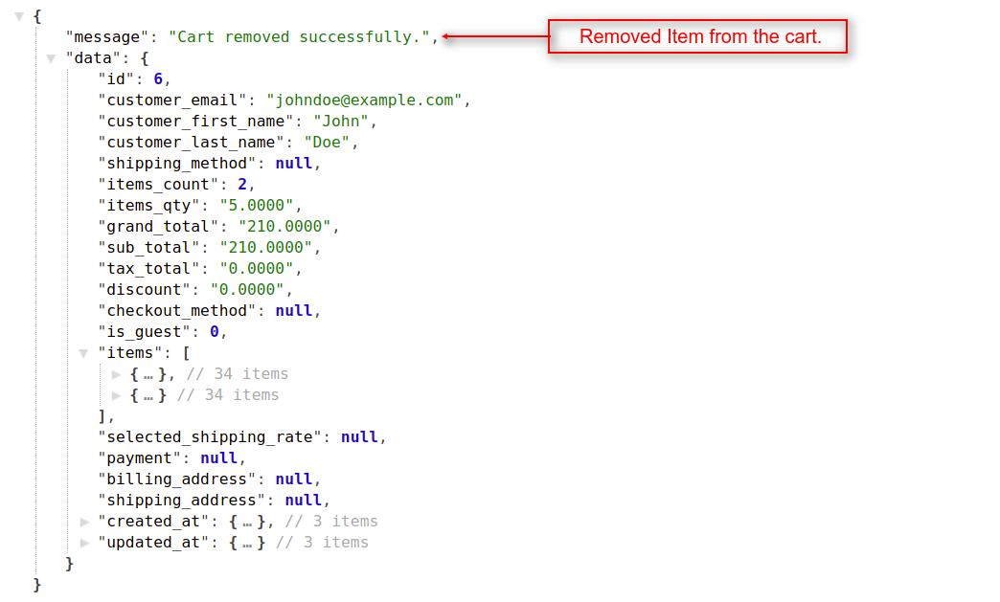
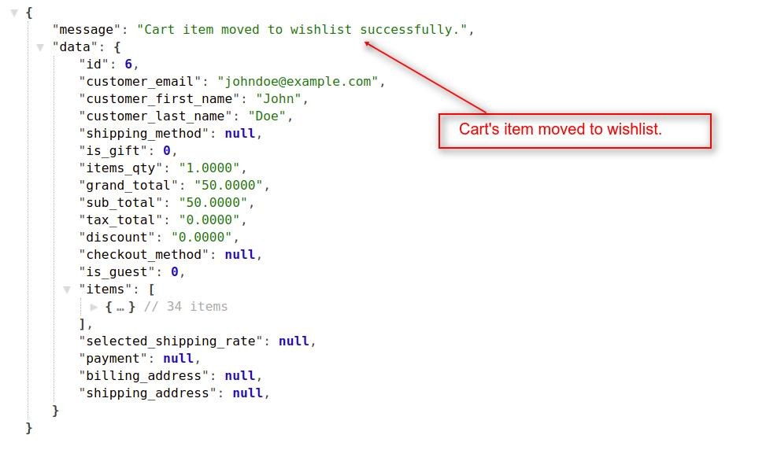
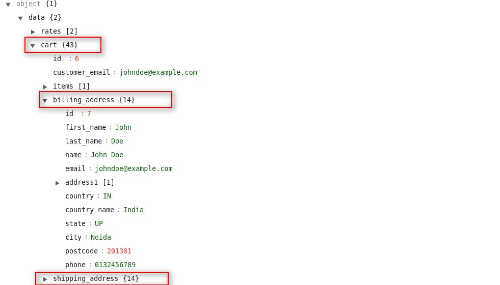
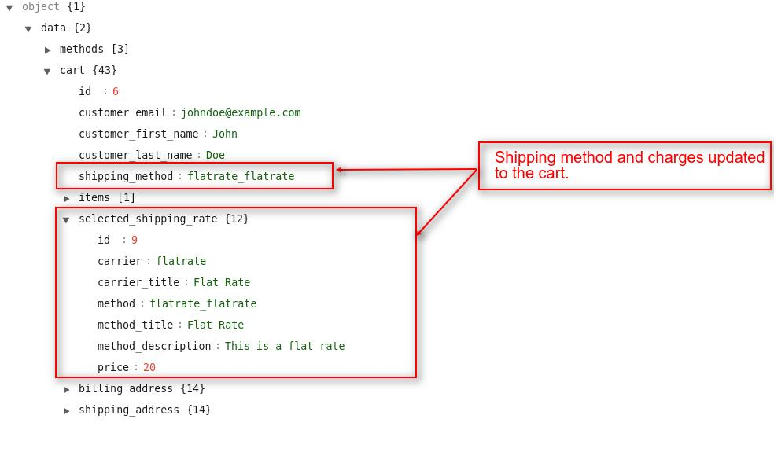
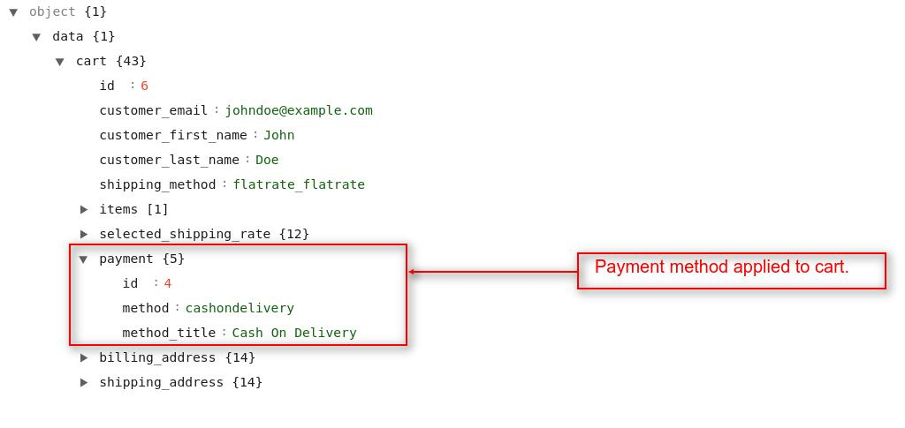
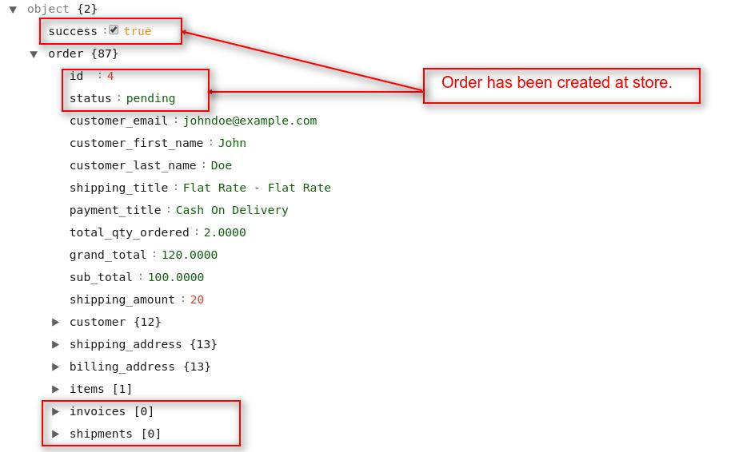

# Cart

In this section, we will use the cart's API. We will see how to add the product to the cart, fetching cart details, updating cart, and many more things related to the cart.

## Add product to cart

By using this API call you can add new products to the cart and also you can add quantity to the existing product in the cart. To do this task, you have to use the `checkout/cart/add/{product_id}` as a request payload in the API URL. This API call will work with both customer's authentication or without customer's authentication.

Currently,Bagisto support the following types of product,

- [Simple](#simple-and-virtual-product)
- [Configurable](#configurable-product)
- [Bundle](#bundle-product)
- [Grouped](#grouped-product)
- [Downloadable](#downloadable-product)
- [Virtual](#simple-and-virtual-product)

Let us discuss each product,

### Simple And Virtual Product

A simple product is a physical item with no configurable option like size, color, etc. Whereas virtual product is slightly same as simple but is not a physical item.

- Headers

  | Key           | Value                 | Info                                 |
  | ------------- | --------------------- | ------------------------------------ |
  | Accept        | application/json      |                                      |
  | Authorization | Bearer `token-string` | Use only when you pass `?token=true` |

- Request

  `POST <host>/api/checkout/cart/add/{product_id}`

- Params

  | Name       | Info         | Type   |
  | ---------- | ------------ | ------ |
  | product_id | Product's ID | Number |
  | quantity   | Quantity     | Number |

  ```json
  {
    "product_id": "product_id",
    "quantity": "quantity"
  }
  ```

### Configurable Product

A Configurable product allows the seller to sell the product in a different variation in Bagisto.

- Headers

  | Key           | Value                 | Info                                 |
  | ------------- | --------------------- | ------------------------------------ |
  | Accept        | application/json      |                                      |
  | Authorization | Bearer `token-string` | Use only when you pass `?token=true` |

- Request

  `POST <host>/api/checkout/cart/add/{product_id}`

- Params

  | Name                         | Info                              | Type   |
  | ---------------------------- | --------------------------------- | ------ |
  | product_id                   | Product's ID                      | Number |
  | quantity                     | Quantity                          | Number |
  | selected_configurable_option | Configurable product variant's ID | Number |
  | super_attribute              | Attribute's ID collections        | Object |

  ```json
  {
    "product_id": "product_id",
    "quantity": "quantity",
    "selected_configurable_option": "configurable_product_variant_id",
    "super_attribute": {
      "attribute_id": "attribute_option_id",
      "attribute_id": "attribute_option_id"
    }
  }
  ```

### Bundle Product

A bundle product includes a customizable product that you can build for your own.

- Headers

  | Key           | Value                 | Info                                 |
  | ------------- | --------------------- | ------------------------------------ |
  | Accept        | application/json      |                                      |
  | Authorization | Bearer `token-string` | Use only when you pass `?token=true` |

- Request

  `POST <host>/api/checkout/cart/add/{product_id}`

- Params

  | Name              | Info                       | Type   |
  | ----------------- | -------------------------- | ------ |
  | product_id        | Product's ID               | Number |
  | quantity          | Quantity                   | Number |
  | bundle_options    | Bundle options collections | Object |
  | bundle_option_qty | Bundle options qunatity    | Object |

  ```json
  {
    "product_id": "product_id",
    "quantity": "quantity",
    "bundle_options": {
      "first_option_id": {
        "index_0": "option_product_id"
      },
      "second_option_id": {
        "index_0": "option_product_id",
        "index_1": "another_option_product_id"
      }
    },
    "bundle_option_qty": {
      "first_option_id": "quantity"
    }
  }
  ```

### Grouped Product

A grouped product is a group of simple products that can be combined together.

- Headers

  | Key           | Value                 | Info                                 |
  | ------------- | --------------------- | ------------------------------------ |
  | Accept        | application/json      |                                      |
  | Authorization | Bearer `token-string` | Use only when you pass `?token=true` |

- Request

  `POST <host>/api/checkout/cart/add/{product_id}`

- Params

  | Name       | Info                                | Type   |
  | ---------- | ----------------------------------- | ------ |
  | product_id | Product's ID                        | Number |
  | quantity   | Quantity                            | Number |
  | qty        | Collection of product with quantity | Object |

  ```json
  {
    "product_id": "product_id",
    "quantity": "quantity",
    "qty": {
      "product_id_1": "quantity",
      "product_id_2": "quantity",
      "product_id_3": "quantity",
      "product_id_4": "quantity"
    }
  }
  ```

### Downloadable Product

Downloadable product allows you to sell digital products, such as eBooks, software applications, music, updates, games, etc.

- Headers

  | Key           | Value                 | Info                                 |
  | ------------- | --------------------- | ------------------------------------ |
  | Accept        | application/json      |                                      |
  | Authorization | Bearer `token-string` | Use only when you pass `?token=true` |

- Request

  `POST <host>/api/checkout/cart/add/{product_id}`

- Params

  | Name       | Info                | Type   |
  | ---------- | ------------------- | ------ |
  | product_id | Product's ID        | Number |
  | quantity   | Quantity            | Number |
  | links      | Collection of links | Object |

  ```json
  {
    "product_id": "product_id",
    "quantity": "quantity",
    "links": {
      "0": "link_id_1",
      "1": "link_id_2"
    }
  }
  ```

### Examples

#### 1. For simple product

- Headers

  | Key           | Value                 | Info                                 |
  | ------------- | --------------------- | ------------------------------------ |
  | Accept        | application/json      |                                      |
  | Authorization | Bearer `token-string` | Use only when you pass `?token=true` |

- Request

  `POST http(s)://example.com/api/checkout/cart/add/24`

- Params

  ```json
  {
    "product_id": 24,
    "quantity": 2
  }
  ```

#### 2. For configurable product

- Headers

  | Key           | Value                 | Info                                 |
  | ------------- | --------------------- | ------------------------------------ |
  | Accept        | application/json      |                                      |
  | Authorization | Bearer `token-string` | Use only when you pass `?token=true` |

- Request

  `POST http(s)://example.com/api/checkout/cart/add/6`

- Params

  ```json
  {
    "product_id": 6,
    "quantity": 1,
    "selected_configurable_option": 26,
    "super_attribute": {
      "23": 2,
      "24": 6
    }
  }
  ```

::: details Response

```json
{
    "message": "Product added to cart successfully.",
    "data": {
        "id": 4,
        "customer_email": "johndoe@example.com",
        "customer_first_name": "John",
        "customer_last_name": "Doe",
        "shipping_method": null,
        "items_qty": "1.0000",
        "grand_total": "50.0000",
        "sub_total": "50.0000",
        "tax_total": "0.0000",
        "discount": "0.0000",
        "checkout_method": null,
        "is_guest": 0,
        "items": [
            {...}, // Cart Item 1
            {...}, // Cart Item 2
        ],
        "selected_shipping_rate": null,
        "payment": null,
        "billing_address": null,
        "shipping_address": null,
    }
}
```



:::

#### 3. Adding more products to the same cart

For this, you need to pass the `product_id` in the request body also.

- Headers

  | Key           | Value                 | Info                                 |
  | ------------- | --------------------- | ------------------------------------ |
  | Accept        | application/json      |                                      |
  | Authorization | Bearer `token-string` | Use only when you pass `?token=true` |

- Request

  `POST http(s)://example.com/api/checkout/cart/add/25`

- Params

  ```json
  {
    "product_id": 25,
    "quantity": 2
  }
  ```

## Get complete cart details

To get the current cart details, you have to use the `checkout/cart` resource in the API URL. You will see in all the `cart` related API, we used the `checkout` prefix. This API call will work with both customer's authentication or without customer's authentication. If the customer is not logged-in to the store, then this API resource will return the guest's cart detail.

- Headers

  | Key           | Value                 | Info                                 |
  | ------------- | --------------------- | ------------------------------------ |
  | Accept        | application/json      |                                      |
  | Authorization | Bearer `token-string` | Use only when you pass `?token=true` |

- Request

  `GET <host>/api/checkout/cart`

### Examples

#### 1. In case of guest customer

In, Bagisto guest cart is handled by session, and Laravel handles session by cookies. So you need to save the cookies for the guest cart when you are adding product to the cart and then send it as a header when you want to fetch.

- Headers

  | Key    | Value               |
  | ------ | ------------------- |
  | Accept | application/json    |
  | Cookie | bagisto_session=key |

- Request

  `GET http(s)://example.com/api/checkout/cart`

::: details Response

```json
{
    "data": {
        "id": 7,
        "customer_email": null,
        "customer_first_name": null,
        "customer_last_name": null,
        "shipping_method": null,
        "items_qty": "1.0000",
        "grand_total": "50.0000",
        "sub_total": "50.0000",
        "tax_total": "0.0000",
        "discount": "0.0000",
        "checkout_method": null,
        "is_guest": 1,
        "items": [
            {...}, // Cart Item 1
            {...} // Cart Item 2
        ],
        "selected_shipping_rate": null,
        "payment": null,
        "billing_address": null,
        "shipping_address": null,
    }
}
```



:::

#### 2. In case of logged in customer

In the case of the logged-in user, no need for cookies as the cart is in the database and linked with the customer.

- Headers

  | Key           | Value                 | Info                                 |
  | ------------- | --------------------- | ------------------------------------ |
  | Accept        | application/json      |                                      |
  | Authorization | Bearer `token-string` | Use only when you pass `?token=true` |

- Request

  `GET http(s)://example.com/api/checkout/cart`

::: details Response

```json
{
    "data": {
        "id": 6,
        "customer_email": "johndoe@example.com",
        "customer_first_name": "John",
        "customer_last_name": "Doe",
        "shipping_method": null,
        "items_count": 2,
        "items_qty": "2.0000",
        "grand_total": "170.0000",
        "sub_total": "170.0000",
        "tax_total": "0.0000",
        "discount": "0.0000",
        "checkout_method": null,
        "is_guest": 0,
        "items": [
            {...}, // Cart Item 1
            {...} // Cart Item 2
        ],
        "selected_shipping_rate": null,
        "payment": null,
        "billing_address": null,
        "shipping_address": null,
    }
}
```


:::

## Empty cart

By using this API call you can remove all the products from the cart. To do this task, you have to use the `checkout/cart/empty` resource in the API URL. This API call will work both with customer's authentication or without customer's authentication.

- Headers

  | Key           | Value                 | Info                                 |
  | ------------- | --------------------- | ------------------------------------ |
  | Accept        | application/json      |                                      |
  | Authorization | Bearer `token-string` | Use only when you pass `?token=true` |

- Request

  `GET <host>/api/checkout/cart/empty`

### Examples

- Headers

  | Key           | Value                 | Info                                 |
  | ------------- | --------------------- | ------------------------------------ |
  | Accept        | application/json      |                                      |
  | Authorization | Bearer `token-string` | Use only when you pass `?token=true` |

- Request

  `GET http(s)://example.com/api/checkout/cart/empty`

::: details Response

```json
{
  "message": "Cart removed successfully.",
  "data": null
}
```

:::

## Update cart

By using this API call you can update the cart's product(s) quantity. To do this task, you have to use the `checkout/cart/update` resource in the API URL. This API call will work with both customer's authentication or without customer's authentication.

- Headers

  | Key           | Value                 | Info                                 |
  | ------------- | --------------------- | ------------------------------------ |
  | Accept        | application/json      |                                      |
  | Authorization | Bearer `token-string` | Use only when you pass `?token=true` |

- Request

  `PUT <host>/api/checkout/cart/update`

- Params

  ```json
  {
    "qty": {
      "cart_item_id": "quantity"
    }
  }
  ```

### Examples

- Headers

  | Key           | Value                 | Info                                 |
  | ------------- | --------------------- | ------------------------------------ |
  | Accept        | application/json      |                                      |
  | Authorization | Bearer `token-string` | Use only when you pass `?token=true` |

- Request

  `PUT http(s)://example.com/api/checkout/cart/update`

- Params

  ```json
  {
    "qty": {
      "4": 2
    }
  }
  ```

::: details Response:

```json
{
    "message": "Cart updated successfully.",
    "data": {
        "id": 7,
        "customer_email": "johndoe@example.com",
        "customer_first_name": "John",
        "customer_last_name": "Doe",
        "shipping_method": null,
        "items_qty": "7.0000",
        "grand_total": "450.0000",
        "sub_total": "450.0000",
        "tax_total": "0.0000",
        "discount": "0.0000",
        "checkout_method": null,
        "is_guest": 0,
        "items": [
            {...}, // Cart Item 1
            {...}, // Cart Item 2
            {...} // Cart Item 3
        ],
        "selected_shipping_rate": null,
        "payment": null,
        "billing_address": null,
        "shipping_address": null,
    }
}
```


:::

## Apply coupon

You can also apply the coupon by using the `checkout/cart/coupon` endpoint.

- Headers

  | Key           | Value                 | Info                                 |
  | ------------- | --------------------- | ------------------------------------ |
  | Accept        | application/json      |                                      |
  | Authorization | Bearer `token-string` | Use only when you pass `?token=true` |

- Request

  `POST <host>/api/checkout/cart/coupon`

- Params

  ```json
  {
    "code": "OFFER20"
  }
  ```

### Examples

Now, let's apply the coupon and check the responses,

- Headers

  | Key           | Value                 | Info                                 |
  | ------------- | --------------------- | ------------------------------------ |
  | Accept        | application/json      |                                      |
  | Authorization | Bearer `token-string` | Use only when you pass `?token=true` |

- Request

  `POST http(s)://example.com/api/checkout/cart/coupon`

- Params

  ```json
  {
    "code": "OFFER20"
  }
  ```

::: details Response

```json
{
  "success": true,
  "message": "Coupon code applied successfully."
}
```

:::

## Remove coupon

For removing the coupon, you just need to hit the `checkout/cart/coupon` endpoint with the `DELETE` method.

- Headers

  | Key           | Value                 | Info                                 |
  | ------------- | --------------------- | ------------------------------------ |
  | Accept        | application/json      |                                      |
  | Authorization | Bearer `token-string` | Use only when you pass `?token=true` |

- Request

  `DELETE <host>/api/checkout/cart/coupon`

### Examples

Let's remove the coupon and check the responses,

- Headers

  | Key           | Value                 | Info                                 |
  | ------------- | --------------------- | ------------------------------------ |
  | Accept        | application/json      |                                      |
  | Authorization | Bearer `token-string` | Use only when you pass `?token=true` |

- Request

  `DELETE http(s)://example.com/api/checkout/cart/coupon`

::: details Response

```json
{
  "success": true,
  "message": "Remove Coupon"
}
```

:::

## Remove specific product from cart

You can remove any particular product from the cart. To do this task, you have to use the `checkout/cart/remove-item/{cart_item_id}` as request payload in the API URL. This API call will work with both customer's authentication or without customer's authentication.

- Headers

  | Key           | Value                 | Info                                 |
  | ------------- | --------------------- | ------------------------------------ |
  | Accept        | application/json      |                                      |
  | Authorization | Bearer `token-string` | Use only when you pass `?token=true` |

- Request

  `GET <host>/api/checkout/cart/remove-item/{cart_item_id}`

- Params

  | Name         | Info           | Type   |
  | ------------ | -------------- | ------ |
  | cart_item_id | Cart item's ID | Number |

### Examples

- Request

  `GET http(s)://example.com/api/checkout/cart/remove-item/15`

::: details Response

```json
{
    "message": "Cart removed successfully.",
    "data": {
        "id": 6,
        "customer_email": "johndoe@example.com",
        "customer_first_name": "John",
        "customer_last_name": "Doe",
        "shipping_method": null,
        "items_count": 2,
        "items_qty": "5.0000",
        "grand_total": "210.0000",
        "sub_total": "210.0000",
        "tax_total": "0.0000",
        "discount": "0.0000",
        "checkout_method": null,
        "is_guest": 0,
        "items": [
            {...},
            {...}
        ],
        "selected_shipping_rate": null,
        "payment": null,
        "billing_address": null,
        "shipping_address": null,
    }
}
```

{:class="screenshot-dimension center"}

:::

## Move product from cart to wishlist

You can move a product from cart to wishlist. To do this task, you have to use the `checkout/cart/move-to-wishlist/{cart_item_id}` as request payload in the API URL.

- Headers

  | Key           | Value                 | Info                                 |
  | ------------- | --------------------- | ------------------------------------ |
  | Accept        | application/json      |                                      |
  | Authorization | Bearer `token-string` | Use only when you pass `?token=true` |

- Request

  `GET <host>/api/checkout/cart/move-to-wishlist/{cart_item_id}`

- Params

  | Name         | Info           | Type   |
  | ------------ | -------------- | ------ |
  | cart_item_id | Cart item's ID | Number |

### Examples

- Request

  `http(s)://example.com/api/checkout/cart/move-to-wishlist/16`

::: details Response:

```json
{
    "message": "Cart item moved to wishlist successfully.",
    "data": {
        "id": 1,
        "customer_email": "johndoe@example.com",
        "customer_first_name": "John",
        "customer_last_name": "Doe",
        "shipping_method": null,
        "items_qty": "1.0000",
        "grand_total": "50.0000",
        "sub_total": "50.0000",
        "tax_total": "0.0000",
        "discount": "0.0000",
        "checkout_method": null,
        "is_guest": 0,
        "items": [
            {...} // Remaining Cart Item
        ],
        "selected_shipping_rate": null,
        "payment": null,
        "billing_address": null,
        "shipping_address": null,
    }
}
```



:::

## Save patient information to cart

At the checkout step, customers can create new patient information or select from the existing patient information for billing & shipping the cart's item. You can achieve this task by using the `checkout/save-patient` resource in the API URL. This API will work for both logged-in customers and guest users.

- Request

  `POST <host>/api/checkout/save-patient`

### Examples

#### 1. For logged in user,

- Request

  `POST http(s)://example.com/api/checkout/save-patient`

- Params

  ```json
  {
	"patient_info": {
  
    "name": "jjjjjjjjjj",
    "age": "john",
    "gender": "doe",
    "relation": 1,
    "id":113
	}
  
  }
  ```


::: details Response

```json
{
    "data": {
        "methods": [
            {
                "method": "cashondelivery",
                "method_title": "Cash On Delivery",
                "description": "Cash On Delivery",
                "sort": "1"
            }
        ],
        "cart": {
            "id": 58,
            "customer_email": "rt@example.com",
            "customer_first_name": "srinirt",
            "customer_last_name": "vasan",
            "shipping_method": null,
            "coupon_code": null,
            "is_gift": 0,
            "items_count": 2,
            "items_qty": "2.0000",
            "exchange_rate": null,
            "global_currency_code": "INR",
            "base_currency_code": "INR",
            "channel_currency_code": "INR",
            "cart_currency_code": "INR",
            "grand_total": "2590.0000",
            "formated_grand_total": "₹2,590.00",
            "base_grand_total": "2590.0000",
            "formated_base_grand_total": "₹2,590.00",
            "sub_total": "2590.0000",
            "formated_sub_total": "₹2,590.00",
            "base_sub_total": "2590.0000",
            "formated_base_sub_total": "₹2,590.00",
            "tax_total": "0.0000",
            "formated_tax_total": "₹0.00",
            "base_tax_total": "0.0000",
            "formated_base_tax_total": "₹0.00",
            "discount": "0.0000",
            "formated_discount": "₹0.00",
            "base_discount": "0.0000",
            "formated_base_discount": "₹0.00",
            "checkout_method": null,
            "is_guest": 0,
            "is_active": 1,
            "conversion_time": null,
            "customer": null,
            "channel": null,
            "items": [
                {
                    "id": 92,
                    "quantity": 1,
                    "sku": "temp41",
                    "type": "simple",
                    "name": "cbv",
                    "coupon_code": null,
                    "weight": "12.0000",
                    "total_weight": "12.0000",
                    "base_total_weight": "12.0000",
                    "price": "400.0000",
                    "formated_price": "₹400.00",
                    "base_price": "400.0000",
                    "formated_base_price": "₹400.00",
                    "custom_price": null,
                    "formated_custom_price": "₹0.00",
                    "total": "400.0000",
                    "formated_total": "₹400.00",
                    "base_total": "400.0000",
                    "formated_base_total": "₹400.00",
                    "tax_percent": "0.0000",
                    "tax_amount": "0.0000",
                    "formated_tax_amount": "₹0.00",
                    "base_tax_amount": "0.0000",
                    "formated_base_tax_amount": "₹0.00",
                    "discount_percent": "0.0000",
                    "discount_amount": "0.0000",
                    "formated_discount_amount": "₹0.00",
                    "base_discount_amount": "0.0000",
                    "formated_base_discount_amount": "₹0.00",
                    "additional": {
                        "_token": "NaQkzr7EfhAZO3Mwj6veah1amb2RiKfra7Q3Lsyh",
                        "product_id": "23",
                        "quantity": 1
                    },
                    "child": null,
                    "product": {
                        "id": 23,
                        "sku": "temp41",
                        "type": "simple",
                        "name": "cbv",
                        "url_key": "temp3",
                        "price": "400.0000",
                        "formated_price": "₹400.00",
                        "short_description": "<p>temp1</p>",
                        "description": "<p>temp1</p>",
                        "images": [],
                        "videos": [],
                        "base_image": {
                            "small_image_url": "http://127.0.0.1:8000/vendor/webkul/ui/assets/images/product/small-product-placeholder.webp",
                            "medium_image_url": "http://127.0.0.1:8000/vendor/webkul/ui/assets/images/product/meduim-product-placeholder.webp",
                            "large_image_url": "http://127.0.0.1:8000/vendor/webkul/ui/assets/images/product/large-product-placeholder.webp",
                            "original_image_url": "http://127.0.0.1:8000/vendor/webkul/ui/assets/images/product/large-product-placeholder.webp"
                        },
                        "created_at": "2021-10-28T06:21:05.000000Z",
                        "updated_at": "2021-10-28T06:21:05.000000Z",
                        "reviews": {
                            "total": 0,
                            "total_rating": 0,
                            "average_rating": 0,
                            "percentage": []
                        },
                        "in_stock": true,
                        "is_saved": false,
                        "is_wishlisted": false,
                        "is_item_in_cart": true,
                        "show_quantity_changer": true
                    },
                    "created_at": "2021-10-28T06:28:26.000000Z",
                    "updated_at": "2021-10-28T10:32:05.000000Z"
                },
                {
                    "id": 93,
                    "quantity": 1,
                    "sku": "anemiaprofile",
                    "type": "simple",
                    "name": "Anemia Profile",
                    "coupon_code": null,
                    "weight": "10.0000",
                    "total_weight": "10.0000",
                    "base_total_weight": "10.0000",
                    "price": "2190.0000",
                    "formated_price": "₹2,190.00",
                    "base_price": "2190.0000",
                    "formated_base_price": "₹2,190.00",
                    "custom_price": null,
                    "formated_custom_price": "₹0.00",
                    "total": "2190.0000",
                    "formated_total": "₹2,190.00",
                    "base_total": "2190.0000",
                    "formated_base_total": "₹2,190.00",
                    "tax_percent": "0.0000",
                    "tax_amount": "0.0000",
                    "formated_tax_amount": "₹0.00",
                    "base_tax_amount": "0.0000",
                    "formated_base_tax_amount": "₹0.00",
                    "discount_percent": "0.0000",
                    "discount_amount": "0.0000",
                    "formated_discount_amount": "₹0.00",
                    "base_discount_amount": "0.0000",
                    "formated_base_discount_amount": "₹0.00",
                    "additional": {
                        "quantity": 1,
                        "product_id": "17",
                        "_token": "NaQkzr7EfhAZO3Mwj6veah1amb2RiKfra7Q3Lsyh"
                    },
                    "child": null,
                    "product": {
                        "id": 17,
                        "sku": "anemiaprofile",
                        "type": "simple",
                        "name": "Anemia Profile",
                        "url_key": "anemia-profile",
                        "price": "2190.0000",
                        "formated_price": "₹2,190.00",
                        "short_description": "<p><span style=\"font-family: -apple-system, BlinkMacSystemFont, 'Segoe UI', Roboto, 'Helvetica Neue', Arial, 'Noto Sans', sans-serif, 'Apple Color Emoji', 'Segoe UI Emoji', 'Segoe UI Symbol', 'Noto Color Emoji'; font-size: 16px; text-align: justify;\">Feeling tired is not new, but continuous weakness may have an undetected underlying cause. These tests serve as a basic and effective screening for anemia</span></p>",
                        "description": "<p><span style=\"font-family: -apple-system, BlinkMacSystemFont, 'Segoe UI', Roboto, 'Helvetica Neue', Arial, 'Noto Sans', sans-serif, 'Apple Color Emoji', 'Segoe UI Emoji', 'Segoe UI Symbol', 'Noto Color Emoji'; font-size: 16px; text-align: justify;\">Feeling tired is not new, but continuous weakness may have an undetected underlying cause. These tests serve as a basic and effective screening for anemia</span></p>",
                        "images": [
                            {
                                "id": 8,
                                "path": "product/17/kjqCqdlx2o3Fh7Y5basgno9JmXnHa5xRPXBjfn4u.jpg",
                                "url": "http://127.0.0.1:8000/storage/product/17/kjqCqdlx2o3Fh7Y5basgno9JmXnHa5xRPXBjfn4u.jpg",
                                "original_image_url": "http://127.0.0.1:8000/storage/product/17/kjqCqdlx2o3Fh7Y5basgno9JmXnHa5xRPXBjfn4u.jpg",
                                "small_image_url": "http://127.0.0.1:8000/cache/small/product/17/kjqCqdlx2o3Fh7Y5basgno9JmXnHa5xRPXBjfn4u.jpg",
                                "medium_image_url": "http://127.0.0.1:8000/cache/medium/product/17/kjqCqdlx2o3Fh7Y5basgno9JmXnHa5xRPXBjfn4u.jpg",
                                "large_image_url": "http://127.0.0.1:8000/cache/large/product/17/kjqCqdlx2o3Fh7Y5basgno9JmXnHa5xRPXBjfn4u.jpg"
                            }
                        ],
                        "videos": [],
                        "base_image": {
                            "small_image_url": "http://127.0.0.1:8000/cache/small/product/17/kjqCqdlx2o3Fh7Y5basgno9JmXnHa5xRPXBjfn4u.jpg",
                            "medium_image_url": "http://127.0.0.1:8000/cache/medium/product/17/kjqCqdlx2o3Fh7Y5basgno9JmXnHa5xRPXBjfn4u.jpg",
                            "large_image_url": "http://127.0.0.1:8000/cache/large/product/17/kjqCqdlx2o3Fh7Y5basgno9JmXnHa5xRPXBjfn4u.jpg",
                            "original_image_url": "http://127.0.0.1:8000/cache/original/product/17/kjqCqdlx2o3Fh7Y5basgno9JmXnHa5xRPXBjfn4u.jpg"
                        },
                        "created_at": "2021-10-16T06:19:11.000000Z",
                        "updated_at": "2021-10-16T06:19:11.000000Z",
                        "reviews": {
                            "total": 0,
                            "total_rating": 0,
                            "average_rating": 0,
                            "percentage": []
                        },
                        "in_stock": true,
                        "is_saved": false,
                        "is_wishlisted": false,
                        "is_item_in_cart": true,
                        "show_quantity_changer": true
                    },
                    "created_at": "2021-10-28T06:28:37.000000Z",
                    "updated_at": "2021-10-28T10:32:05.000000Z"
                }
            ],
            "selected_shipping_rate": null,
            "payment": null,
            "billing_address": null,
            "shipping_address": null,
            "created_at": "2021-10-28T06:28:26.000000Z",
            "shipping_date": null,
            "updated_at": "2021-10-28T10:32:05.000000Z",
            "taxes": "{\"0\":0}",
            "formated_taxes": "{\"0\":\"\\u20b90.00\"}",
            "base_taxes": "{\"0\":0}",
            "formated_base_taxes": "{\"0\":\"\\u20b90.00\"}",
            "formated_discounted_sub_total": "₹2,590.00",
            "formated_base_discounted_sub_total": "₹2,590.00"
        }
    }
}
```


:::


## Save addresses to cart

At the checkout step, customers can create new addresses or select from the existing addresses for billing & shipping the cart's item. You can achieve this task by using the `checkout/save-address` resource in the API URL. This API will work for both logged-in customers and guest users.

- Request

  `POST <host>/api/checkout/save-address`

### Examples

#### 1. For logged in user,

- Request

  `POST http(s)://example.com/api/checkout/save-address`

- Params

  ```json
  {
    "billing": {
      "address1": {
        "0": ""
      },
      "use_for_shipping": "false",
      "first_name": "john",
      "last_name": "doe",
      "email": "john@gmail.com",
      "address_id": 1
    },
    "shipping": {
      "address1": {
        "0": ""
      },
      "first_name": "john",
      "last_name": "doe",
      "email": "john@gmail.com",
      "address_id": 2
    }
  }
  ```

#### 2. For guest user

- Headers

  | Key    | Value            |
  | ------ | ---------------- |
  | Accept | application/json |

- Request

  `POST http(s)://example.com/api/checkout/save-address`

- Params

  ```json
  {
    "billing": {
      "address1": {
        "0": "H 23"
      },
      "use_for_shipping": "true",
      "first_name": "john",
      "last_name": "doe",
      "email": "john@webkul.com",
      "city": "noida",
      "state": "DL",
      "postcode": "110092",
      "country": "IN",
      "phone": "8802097347"
    },
    "shipping": {
      "address1": {
        "0": ""
      }
    }
  }
  ```

::: details Response

```json
{
    "data": {
        "rates": [{...},{...}],
        "cart": {
            "id": 6,
            "customer_email": "johndoe@example.com",
            "items": [{...}, {...}],
            "billing_address": {
                "id": 7,
                "first_name": "John",
                "last_name": "Doe",
                "name": "John Doe",
                "email": "johndoe@example.com",
                "address1": [
                    "Block H-ARP Park, Sector 63 "
                ],
                "country": "IN",
                "country_name": "India",
                "state": "UP",
                "city": "Noida",
                "postcode": 201301,
                "phone": "0132456789"
            },
            "shipping_address": {
                "id": 8,
                "first_name": "John",
                "last_name": "Doe",
                "name": "John Doe",
                "email": "johndoe@example.com",
                "address1": [
                    "Block H-ARP Park, Sector 63 "
                ],
                "country": "IN",
                "country_name": "India",
                "state": "UP",
                "city": "Noida",
                "postcode": 201301,
                "phone": "0132456789"
            }
        }
    }
}
```



:::

## Save shipping method to cart

After saving the customer's addresses to the cart, you have to select a shipping method to proceed for completing the order. You can achieve this task by using the `checkout/save-shipping` resource in the API URL. The shipping method and changes will apply to the cart through this API call. This API will work for both logged-in customers and guest users.

- Headers

  | Key           | Value                 | Info                                 |
  | ------------- | --------------------- | ------------------------------------ |
  | Accept        | application/json      |                                      |
  | Authorization | Bearer `token-string` | Use only when you pass `?token=true` |

- Request

  `POST <host>/api/checkout/save-shipping`

- Params

  ```json
  {
    "shipping_method": "shipping_method_key",
    "shipping_date": "shipping_date",
    "shipping_time": "shipping_time",
  }
  ```

### Examples

- Headers

  | Key           | Value                 | Info                                 |
  | ------------- | --------------------- | ------------------------------------ |
  | Accept        | application/json      |                                      |
  | Authorization | Bearer `token-string` | Use only when you pass `?token=true` |

- Request

  `POST http(s)://example.com/api/checkout/save-shipping`

- Params

  ```json
  {
    "shipping_method": "flatrate_flatrate",
	"shipping_date": "2021-10-30",
    "shipping_time": "15:20",
  }
  ```

::: details Response

```json
{
    "data": {
        "methods": [{...},{...}],
        "cart": {
        "id": 6,
        "customer_email": "johndoe@example.com",
        "customer_first_name": "John",
        "customer_last_name": "Doe",
        "shipping_method": "flatrate_flatrate",
        "items": [{...}],
        "selected_shipping_rate": {
            "id": 9,
            "carrier": "flatrate",
            "carrier_title": "Flat Rate",
            "method": "flatrate_flatrate",
            "method_title": "Flat Rate",
            "method_description": "This is a flat rate",
            "price": 20,
        },
        "payment": null,
        "billing_address": {...},
        "shipping_address": {...}
        }
    }
}
```



:::

## Save payment method to cart

After applying the shipping method to the cart, you have to select a payment method to proceed for completing the order. You can achieve this task by using the `checkout/save-payment` resource in the API URL. By using this API payment method will apply to the cart and will work with both logged-in customers and as well as guest users.

- Headers

  | Key           | Value                 | Info                                 |
  | ------------- | --------------------- | ------------------------------------ |
  | Accept        | application/json      |                                      |
  | Authorization | Bearer `token-string` | Use only when you pass `?token=true` |

- Request

  `POST <host>/api/checkout/save-payment`

- Params

  ```json
  {
    "payment": {
      "method": "payment_method_key"
    }
  }
  ```

### Examples

- Headers

  | Key           | Value                 | Info                                 |
  | ------------- | --------------------- | ------------------------------------ |
  | Accept        | application/json      |                                      |
  | Authorization | Bearer `token-string` | Use only when you pass `?token=true` |

- Request

  `POST http(s)://example.com/api/checkout/save-payment`

- Params

  ```json
  {
    "payment": {
      "method": "cashondelivery"
    }
  }
  ```

::: details Response

```json
{
    "data": {
        "cart": {
        "id": 6,
        "customer_email": "johndoe@example.com",
        "customer_first_name": "John",
        "customer_last_name": "Doe",
        "shipping_method": "flatrate_flatrate",
        "items": [{...}],
        "selected_shipping_rate": {...},
        "payment": {
            "id": 4,
            "method": "cashondelivery",
            "method_title": "Cash On Delivery"
        },
        "billing_address": {...},
        "shipping_address": {...}
        }
    }
}
```



:::

## Save Order

After applying shipping addresses, shipping methods, and payment methods to the cart, now finally you have to create/save the order. You can achieve this task by using the `checkout/save-order` resource in the API URL. By using this API order will be placed and save to the current store and this API will work for both logged-in customers and with guest users.

- Headers

  | Key           | Value                 | Info                                 |
  | ------------- | --------------------- | ------------------------------------ |
  | Accept        | application/json      |                                      |
  | Authorization | Bearer `token-string` | Use only when you pass `?token=true` |

- Request

  `POST <host>/api/checkout/save-order`

### Examples

- Headers

  | Key    | Value            |
  | ------ | ---------------- |
  | Accept | application/json |

- Request

  `POST http(s)://example.com/api/checkout/save-order`

::: details Response

```json
{
    "success": true,
    "order": {
        "id": 4,
        "status": "pending",
        "customer_email": "johndoe@example.com",
        "customer_first_name": "John",
        "customer_last_name": "Doe",
        "shipping_title": "Flat Rate - Flat Rate",
        "payment_title": "Cash On Delivery",
        "total_qty_ordered": "2.0000",
        "grand_total": "120.0000",
        "shipping_amount": 20,
        "customer": {...},
        "shipping_address": {...},
        "billing_address": {...},
        "items": [{...}],
        "invoices": [],
        "shipments": []
    }
}
```



:::
